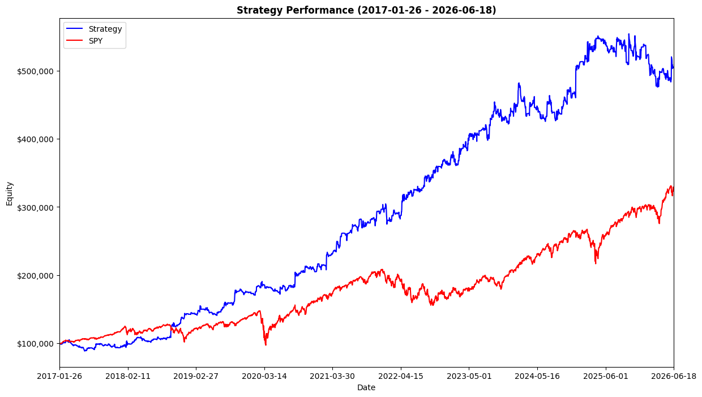
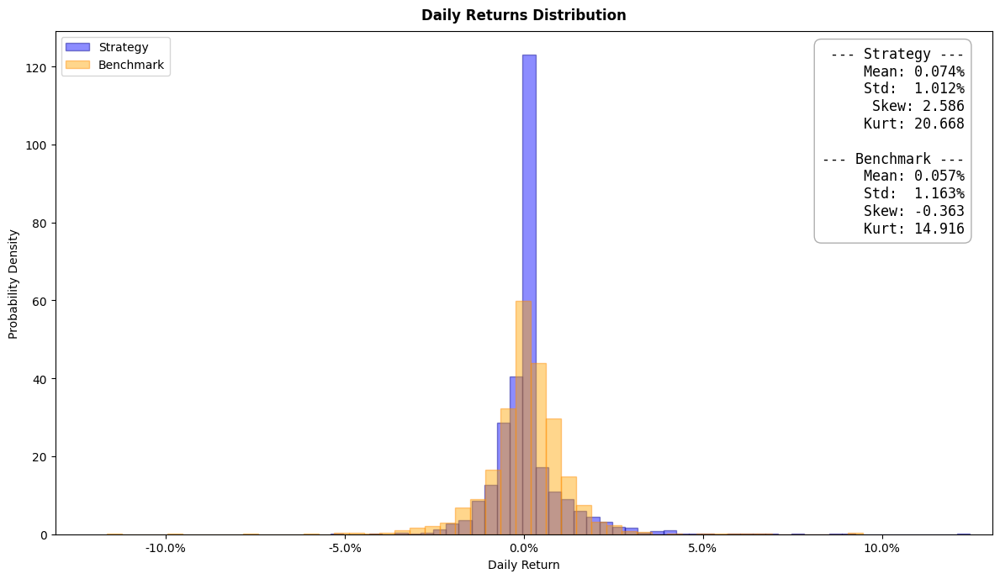
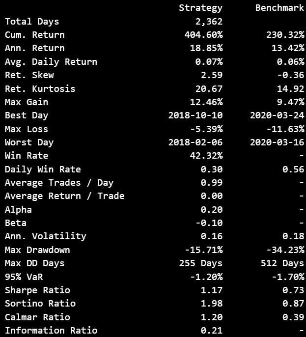

# SPY Momentum Strategy Backtest

todo: update readme
todo: optimise pd -> np
todo: consider refactoring tearsheet and connector into dataclasses

Backtesting framework for the strategy outlined in SFI paper [Beat the Market](https://github.com/nip403/SPY-Momentum-Strategy-Backtest/blob/main/Beat%20the%20Market%20An%20Effective%20Intraday%20Momentum%20Strategy%20for%20S%26P500%20ETF%20(SPY).pdf).

Example usage in main.

